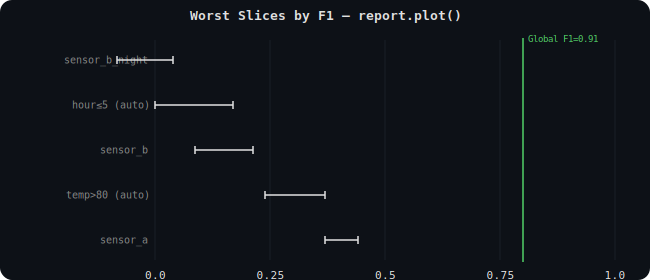

<div align="center">

<br>


# sliceval

### Your model's global metric is lying to you.

**Slice-based evaluation for ML models. Find hidden failures. Ship with confidence.**

<br>

[](https://pypi.org/project/sliceval/)
[](https://www.python.org/downloads/)
[](https://github.com/kartikeyamandhar/sliceval/actions/workflows/ci.yml)
[](https://opensource.org/licenses/MIT)
[](https://scikit-learn.org/)

<br>

```
Your dashboard says F1 = 0.91. You ship.
Three months later, a production line keeps missing failures.

The 200-sample subgroup that matters? It was at F1 = 0.41.
The global metric never moved.
```

<br>



<br>

[Quick Start](#-quick-start) · [The Problem](#-the-problem) · [How It Works](#-how-it-works) · [API Reference](#-full-api-reference) · [Use Cases](#-real-world-use-cases)

</div>

---

<br>

## ⚡ Quick Start

```bash
pip install sliceval
```

```python
from sliceval import SliceEvaluator

# 1. Wrap your trained model + test data
ev = SliceEvaluator(model, X_test, y_test)

# 2. Define slices you care about
ev.add_slice('sensor_b', X_test['sensor_type'] == 'B')
ev.add_slice('night_shift', lambda X: X['hour'] < 6)

# 3. Auto-discover slices you didn't think of
ev.discover_slices()

# 4. Evaluate — model.predict() called once, all slices reuse cached predictions
report = ev.evaluate()

# 5. See the truth
print(report.worst_slices())
```

<br>



<br>

> Every metric includes a confidence interval, sample count, delta from global, and a significance test. No ambiguity.

<br>

---

<br>

## 🔍 The Problem

Standard ML evaluation computes one number across the entire test set. That number is a weighted average where majority subgroups dominate and minority subgroups disappear.

<br>



<br>

### Why not just use accuracy / F1 / confusion matrix?

| What You're Using | What It Tells You | What It Hides |
|---|---|---|
| **Global F1 / Accuracy** | Average performance across all data | Which subgroups are failing |
| **Confusion Matrix** | TP/FP/TN/FN counts overall | Where those errors concentrate |
| **Per-class Metrics** | Performance per label | Feature-driven failure patterns |
| **sliceval** | Performance per data subgroup with CI + significance | Nothing. That's the point. |

> 💡 **The confusion matrix tells you *what* the model gets wrong. sliceval tells you *where* and *why*.**

<br>

---

<br>

## 🔬 How It Works

### Three ways to define slices

<br>



<br>

### Tree Discovery — how it finds failures automatically

A shallow decision tree is fit on model errors. Each leaf represents a region of feature space where the model systematically fails. The leaves become candidate slices.

<br>



<br>

> 🚀 **Tree discovery is the default.** It's fast and finds axis-aligned failure regions. Use beam search when you need exhaustive coverage and can afford the compute.

<br>

---

<br>

## 📊 Visual Output

### Bar Chart with Confidence Intervals

```python
fig = report.plot(metric='f1', top_n=10)
```

<br>



<br>

### Confidence Intervals on Every Slice

<br>



<br>

- Red = significantly worse than global (delta < -0.1)
- Amber = somewhat worse (-0.1 ≤ delta < 0)
- Green = at or above global
- Dashed line = global metric baseline

<br>

---

<br>

## 🏭 Real-World Use Cases

<table>
<tr>
<td width="50%">

### 🔧 Predictive Maintenance
Your sensor model hits F1 = 0.91 globally. But Sensor Type B on night shifts? F1 = 0.41. That production line keeps missing failures. `sliceval` finds it before deployment.

### 🏥 Healthcare / Clinical AI
A diagnostic model performs well overall — but recall drops to 0.25 for patients with large tumor radius. In cancer diagnosis, a missed malignant case kills. `sliceval` surfaces exactly where recall collapses.

</td>
<td width="50%">

### 💳 Fraud Detection
Your fraud model catches 95% of fraud globally. But for transactions over $10K from new accounts? Precision drops to 0.30 — you're blocking legitimate high-value customers. `sliceval` shows you the segment.

### 🎯 Recommendation Systems
CTR model looks great in aggregate. But for users in the 18-24 cohort with < 5 interactions? The model is essentially random. `sliceval` quantifies the cold-start problem per segment.

</td>
</tr>
</table>

<br>

---

<br>

## 📊 Supported Metrics

### Classification

| Metric | Key | Notes |
|---|---|---|
| F1 Score | `'f1'` | `average='binary'` or `'macro'` for multiclass |
| Precision | `'precision'` | Same averaging |
| Recall | `'recall'` | Same averaging |
| Accuracy | `'accuracy'` | — |
| ROC AUC | `'auc'` | Requires `predict_proba()` |
| Expected Calibration Error | `'ece'` | Requires `predict_proba()` |

### Regression

| Metric | Key |
|---|---|
| Root Mean Squared Error | `'rmse'` |
| Mean Absolute Error | `'mae'` |

<br>

---

<br>

## 🔒 Confidence Intervals & Significance

Every metric on every slice gets a confidence interval and a p-value. Two CI methods:

| Method | How | When |
|---|---|---|
| `'bootstrap'` (default) | Resample N times, take percentiles | Always works, any metric |
| `'wilson'` | Wilson score interval | Binary classification only, faster |

```python
ev = SliceEvaluator(
    model, X_test, y_test,
    ci_method='bootstrap',
    ci_alpha=0.05,        # 95% CI
    n_bootstrap=1000,
)
```

> ⚠️ **When `ci_method='wilson'` is set but a metric doesn't support it (e.g., F1), sliceval silently falls back to bootstrap. No warning, no error — Wilson is a preference, not a requirement.**

<br>

---

<br>

## 📦 MLflow Integration

One call. Everything logged.

<br>



<br>

```python
import mlflow

with mlflow.start_run():
    report = ev.evaluate()
    report.to_mlflow()  # uses active run
```

> 💡 Requires `pip install sliceval[mlflow]`. Raises `ImportError` with install instructions if missing.

<br>

---

<br>

## 🏗️ Performance & Design

Built for production ML pipelines, not notebooks-only.

<br>



<br>

| Property | Detail |
|---|---|
| **Single inference pass** | `model.predict()` called once. 100 slices = same cost as 1. |
| **Lazy evaluation** | Callable masks evaluated at `.evaluate()` time, not at definition. |
| **Non-invasive** | Wraps any sklearn-compatible model. No training code changes. |
| **Composable** | Use slicing without discovery. Use discovery without MLflow. Each piece works alone. |
| **Zero heavy deps** | Core = numpy + pandas + sklearn. MLflow, matplotlib, scipy are optional. |
| **Tested** | 162 tests including stress tests across 7 datasets, 13 model types, 3 task types. |

<br>

---

<br>

## 🧰 Compared to Other Tools

<br>



<br>

---

<br>

## ⚠️ Common Mistakes

**1. Using discovery without manual slices.** Discovery is automated, not omniscient. Always add slices for known risk segments first. Discovery finds what you missed.

**2. Ignoring p-values.** A slice with delta = -0.30 and p = 0.45 is noise. A slice with delta = -0.10 and p = 0.002 is real. Filter by significance.

**3. Setting `min_support` too low.** A slice with 8 samples and F1 = 0.0 is not actionable. Keep `min_support >= 0.05` unless you have a specific reason.

**4. Evaluating on training data.** `sliceval` is for test/validation sets. Slice metrics on training data tell you about memorization, not generalization.

<br>

---

<br>

## 🛡️ Error Handling

sliceval fails loudly with descriptive messages. No silent corruption.

<details>
<summary><strong>Exceptions (click to expand)</strong></summary>

| Situation | Exception | Message |
|---|---|---|
| `X` is not a DataFrame | `TypeError` | `X must be a pd.DataFrame, got ndarray` |
| `len(X) != len(y)` | `ValueError` | `X and y must have the same length. Got X: 500, y: 400` |
| Invalid task string | `ValueError` | `task must be 'binary', 'multiclass', or 'regression'. Got: 'classify'` |
| Unknown metric | `ValueError` | `Unknown metric 'f2'. Valid metrics: [...]` |
| `auc`/`ece` without `predict_proba` | `ValueError` | `Metric 'auc' requires model.predict_proba()` |
| Slice mask wrong length | `ValueError` | `Slice 'x' mask has length 50, expected 1000` |
| Empty slice | `ValueError` | `Slice 'x' has 0 samples. Check your mask condition.` |
| Discovery metric not in list | `ValueError` | `Discovery metric 'auc' is not in the evaluator's metric list` |
| MLflow not installed | `ImportError` | `MLflow integration requires: pip install sliceval[mlflow]` |
| matplotlib not installed | `ImportError` | `Plotting requires: pip install sliceval[plot]` |

</details>

<details>
<summary><strong>Warnings (click to expand)</strong></summary>

| Situation | Warning |
|---|---|
| Slice with < 30 samples | `Slice 'x' has 15 samples. Metrics may be unreliable.` |
| Duplicate slice name | `Slice 'x' already exists and will be overwritten.` |
| No slices before evaluate | `No slices defined. Call add_slice() or discover_slices().` |

</details>

<br>

---

<br>

## 📖 Full API Reference

<details>
<summary><strong>SliceEvaluator (click to expand)</strong></summary>

```python
SliceEvaluator(
    model,                          # any object with .predict()
    X: pd.DataFrame,                # test features (must be DataFrame)
    y: pd.Series | np.ndarray,      # ground truth labels
    task: str = 'binary',           # 'binary' | 'multiclass' | 'regression'
    metrics: list = None,           # default depends on task
    ci_method: str = 'bootstrap',   # 'bootstrap' | 'wilson'
    ci_alpha: float = 0.05,         # confidence level = 1 - ci_alpha
    n_bootstrap: int = 1000,        # bootstrap iterations
    average: str = 'macro',         # multiclass averaging
    random_state: int = 42,
)
```

**`add_slice(name, mask)`**

```python
ev.add_slice(
    name: str,                      # human-readable label
    mask,                           # pd.Series[bool] | np.ndarray[bool] | callable
)
```

If `mask` is callable, it receives `X` and must return a boolean array. Evaluated lazily at `.evaluate()` time.

**`discover_slices(method, **kwargs)`**

```python
ev.discover_slices(
    method: str = 'tree',           # 'tree' | 'beam'
    max_depth: int = 3,             # max feature conjunctions
    min_support: float = 0.05,      # min fraction of test set
    metric: str = 'f1',             # metric to rank by
    n_slices: int = 10,             # max slices to return
    significance: float = 0.05,     # p-value threshold
)
```

**`evaluate() -> SliceReport`**

Runs inference once, computes all metrics on all slices, returns a `SliceReport`.

</details>

<details>
<summary><strong>SliceReport (click to expand)</strong></summary>

| Attribute | Type | Description |
|---|---|---|
| `global_metrics` | `dict` | `{'f1': 0.91, ...}` |
| `slices` | `list[Slice]` | All evaluated slices |
| `metrics` | `list[SliceMetrics]` | Per-slice results |
| `task` | `str` | Task type |
| `evaluated_at` | `datetime` | UTC timestamp |

**`worst_slices(n=5, metric=None, min_support=0.0) -> pd.DataFrame`**

Returns `n` worst slices sorted by `delta` ascending.

**`to_dataframe() -> pd.DataFrame`**

Full slice x metric matrix. First row is `[global]`. Columns per metric: `{m}_value`, `{m}_ci_lower`, `{m}_ci_upper`, `{m}_delta`, `{m}_p_value`.

**`to_mlflow(run_id=None, artifact_path='slice_eval')`**

Logs CSV and JSON artifacts to MLflow.

**`plot(metric=None, top_n=10, figsize=(10, 6)) -> Figure`**

Horizontal bar chart with CI error bars and global baseline.

</details>

<details>
<summary><strong>Slice and SliceMetrics dataclasses (click to expand)</strong></summary>

```python
@dataclass
class Slice:
    name: str                       # human-readable label
    mask: np.ndarray                # boolean, shape (n_test_samples,)
    n_samples: int
    support: float                  # n_samples / len(X_test)
    source: str                     # 'manual' | 'tree' | 'beam'
    feature_conditions: list        # e.g. ['sensor_type == B', 'hour < 6']

@dataclass
class SliceMetrics:
    slice_name: str
    n_samples: int
    support: float
    metrics: dict                   # {'f1': 0.41, ...}
    ci_lower: dict                  # {'f1': 0.33, ...}
    ci_upper: dict                  # {'f1': 0.49, ...}
    delta: dict                     # {'f1': -0.50, ...}  (slice - global)
    p_value: dict                   # {'f1': 0.003, ...}
```

</details>

<br>

---

<br>

## 🗺️ Roadmap

- [ ] Multi-model comparison (compare slices across model versions)
- [ ] HTML report export (standalone, no MLflow needed)
- [ ] Weights and Biases integration
- [ ] Slice-aware cross-validation
- [ ] Interactive slice explorer (panel/streamlit widget)

<br>

---

<br>

## 🧑‍💻 Development

```bash
git clone https://github.com/kartikeyamandhar/sliceval.git
cd sliceval
python -m venv .venv
source .venv/bin/activate
pip install -e .
pip install pytest
pytest tests/ -v
```

### Project Structure

```
sliceval/
├── __init__.py                 # public API
├── evaluator.py                # SliceEvaluator
├── slice.py                    # Slice, SliceMetrics
├── metrics.py                  # metric computation + CI
├── report.py                   # SliceReport
├── discovery/
│   ├── tree.py                 # decision tree discovery
│   └── beam.py                 # beam search (SliceFinder)
├── integrations/
│   └── mlflow.py               # MLflow artifact export
└── utils/
    ├── stats.py                # bootstrap, Wilson, permutation tests
    └── validation.py           # input validation
```

<br>

---

<br>

<div align="center">

### Built because global metrics are dangerous defaults.

**If this saves you from a production failure, consider starring the repo.**

⭐ [github.com/kartikeyamandhar/sliceval](https://github.com/kartikeyamandhar/sliceval)

<br>

MIT License · Made by [Kartikeya Mandhar](https://github.com/kartikeyamandhar)

</div>